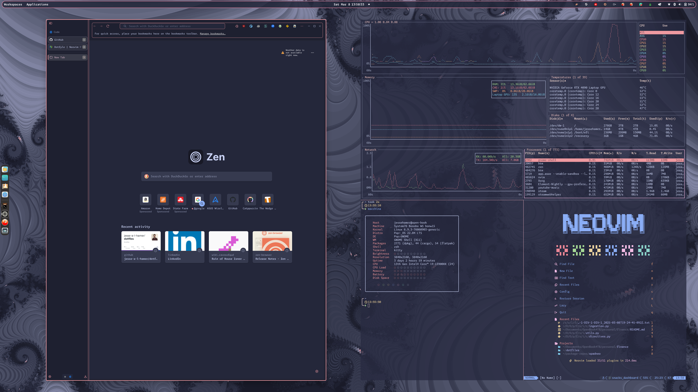

# dofiles

This is my dotfiles repository.

There are many like it, but this one is mine.

## Screenshots

## Introduction

I suppose this project has its genesis it my attempts to improve
my software development skills.

I first learned to _program_ as a CS minor in undergrad, well over a decade ago.
While I'm grateful for the education I received, one thing I found sorely lacking
was any emphasis on the _tools of the software craftsperson's trade_. Perhaps this
is a consequence of having studied CS, mathematics, and statistics,
rather than SWE, but emphasis was always on algorithms and data structures
from a more theoretical perspective.

In recent years, however, I have gained an appreciation for the importance
of cultivating one's skill with the command line. Related to this, I have also
learned what profound joy and reward there is in cultivating a
well-functioning and beautiful development environment.

Thus it is that I decided to take the organizing of my dotfiles more seriously
and publish this repository.

I intend to continue cultivating and refining this repo indefinitely, as a garden.

So, welcome to my garden. I hope you enjoy walking through. If nothing else,
I hope it inspires you to cultivate your own garden, or reinvigorates a love
for the garden that may already be in your keeping.

## Installation

I use [rotz](https://volllly.github.io/rotz/) to manage
symlinking of my dotfiles, as well as installation of tools on a new system.
I highly recommend that you check it out!

Assuming you've [installed rotz](https://volllly.github.io/rotz/docs/getting-started#installation),
you can bootstrap a new system with `rotz install`. Once installation is complete,
link the dotfiles with `rotz link`.

## Tools

I have tried to organize the dotfiles into high-level groups more or less by topic.
The list below is not an exhaustive list of the tools I'm
currently using, but it does capture most of the key tools I use and whose
configurations I have so far messed with.

> [!note] Theming and Fonts
> After theme-hopping for several years
> ([gruvbox](https://github.com/morhetz/gruvbox)
> was my go-to theme for most of those years),
> I finally settled upon [Catppuccin](https://catppuccin.com/)
> (Macchiatowith a maroon accent 😉). Aside from being a great color scheme,
> I love how configurable (four different variants,
> with even more "accent" colors) and _pervasive_ Catppuccin is.
> There might be color schemes that I like more _in isolation_, but
> the widespread availability of official ports and
> the community's emphasis on documentation means I can give
> basically my _entire system_ a consistent look and feel. Check out the
> Catppuccin website or [github](https://github.com/catppuccin) for all of the
> officially maintained ports.
>
> I've also done some font-hopping, with my current favorite being the
> [Monaspace family](https://monaspace.githubnext.com/) of fonts. This is actually
> a collection of five distinct font faces, each of which has its own voice.
> In my own set up I'm following the pattern detailed in the Neovim plugin
> [monaspace.nvim](https://github.com/jackplus-xyz/monaspace.nvim); for example,
> my regular font face is Monaspace Argon, which gives a neutral, sans-serif
> look to normal text, while I use Monaspace Radon for the italic font face,
> which conveys a more informal, handwritten look. See the
> [kitty terminal dotfiles](terminal/kitty/kitty/kitty.conf) for more details.

### Browser

- [Zen](https://zen-browser.app/): privacy- and performance-focused,
  community-maintained, Firefox-based browser. This is my daily driver.
- [Brave](https://brave.com): privacy- and performance-focused Chromium-based browser.
  This is my backup browser which I keep around in case I need Chromium.

### CLI

- [bat](https://github.com/sharkdp/bat): like `cat`, but better
- [bottom](https://github.com/ClementTsang/bottom): system monitoring
- [delta](https://github.com/dandavison/delta): rust-based git diff/merge tool
- [dust](https://github.com/bootandy/dust): rust-based du-replacement
- [espanso](https://github.com/espanso/espanso): text expander
- [eza](https://github.com/eza-community/eza): rust-based ls replacement
- [funzzy](https://github.com/cristianoliveira/funzzy): rust-based filesystem watcher
- [fzf](https://github.com/junegunn/fzf): fuzzy-finder
- [glow](https://github.com/charmbracelet/glow): render markdown documents with 🌈*pizazz*🌠
- [hexyl](https://github.com/sharkdp/hexyl): rust-based hex viewer
- [keepassxc](https://keepassxc.org/): password manager
- [lazygit](https://github.com/jesseduffield/lazygit): cool, easy to use TUI git-interface
- [neofetch](https://github.com/dylanaraps/neofetch): print out a quick system
  summary with nice ascii art
- [procs](https://github.com/dalance/procs): rust-based ps replacement
- [ripgrep (rg)](https://github.com/BurntSushi/ripgrep): rust-based grep replacement
- [rm-improved (rip)](https://github.com/nivekuil/rip): rust-based rm replacement
- [tealdeer](https://github.com/tealdeer-rs/tealdeer): rust-based tldr replacement;
  simple, community-driven man pages
- [weathercrab](https://github.com/ttytm/wthrr-the-weathercrab): rust-based
  weather app
- [xsv](https://github.com/paulgirard/xsv): rust-based program for handling csv files
- [yazi](https://github.com/sxyazi/yazi): terminal file manager, written in rust
- [zoxide](https://github.com/ajeetdsouza/zoxide): rust-based cd replacement

### Editor

I recently switched from [JetBrains](https://www.jetbrains.com/)
([Intellij](https://www.jetbrains.com/idea/),
[PyCharm](https://www.jetbrains.com/idea/))
to [Neovim](https://neovim.io/), and I'm absolutely loving it.
As an AI/Data Scientist, the only itch that Neovim can't scratch is
Jupyter Notebook support, but there are plugins to work around this,
and if need be, I can just fire up [JupyterLab](https://jupyter.org/) in my browser.

When I started using Neovim, I was using the [AstroNvim](https://astronvim.com/)
distribution, which I would still highly recommend to anybody just
starting on their Neovim odyssey.

After a couple of months using AstroNvim, however, I decided I wanted to really
understand how Neovim and its configuration worked. Thus, I made the switch to a
[kickstart](https://github.com/nvim-lua/kickstart.nvim)-based config
(actually, I'm using [kickstart-modular](https://github.com/dam9000/kickstart-modular.nvim)).
This config is maintained in the `editor/neovim/` directory.

In the remainder of this section, I'll highlight some of the key plugins I'm using.

- [Folke](https://github.com/folke)'s plugins should be their own section. (At
  this point, I've probably all but recreated Folke's own Neovim distribution,
  [LazyVim](https://www.lazyvim.org/).)
  - [Lazy](https://github.com/folke/lazy.nvim): plugin manager
  - [flash](https://github.com/folke/flash.nvim):
    jump around the buffer in a flash
  - [which-key](https://github.com/folke/which-key.nvim): keymap popup/organizer
  - [noice](https://github.com/folke/noice.nvim):
    replacement ui for messages, cmdline, and the popupmenu
  - [trouble](https://github.com/folke/trouble.nvim):
    handy list viewer for diagnostics, quickfixes, etc.
  - [snacks](https://github.com/folke/snacks.nvim): tons of small QoL plugins.
    I'm using just about all of the included "snacks" (modules),
    but here I'll highlight those that provide some core functionality:
    - [dashboard](https://github.com/folke/snacks.nvim/blob/main/docs/dashboard.md):
      aesthetic, useful landing page when entering neovim
      - (with `{ example = "advanced" }`)
    - [indent](https://github.com/folke/snacks.nvim/blob/main/docs/indent.md):
      indent guides & scopes
    - [notifier](https://github.com/folke/snacks.nvim/blob/main/docs/notifier.md):
      pretty notification interface and history
    - [picker](https://github.com/folke/snacks.nvim/blob/main/docs/picker.md):
      an amazing Telescope replacement/fuzzy finder
    - [statuscolumn](https://github.com/folke/snacks.nvim/blob/main/docs/statuscolumn.md):
      pretty statuscolumn
    - [zen](https://github.com/folke/snacks.nvim/blob/main/docs/zen.md):
      "Zen mode", for distraction-free coding
- [blink.cmp](https://github.com/Saghen/blink.cmp): completion
- [lualine](https://github.com/nvim-lualine/lualine.nvim): statusline
- [obsidian](https://github.com/epwalsh/obsidian.nvim):
  integration between the
  [Obsidian](https://obsidian.md/) note-taking app and Neovim

### Git

This directory just contains my basic `.gitconfig` file. Nothing too fancy.

### Python

As an AI/Data Scientist, Python is my primary language. Here are some of the tools
I enjoy using:

- [uv](https://docs.astral.sh/uv/):
  a fast package manager, virtual environment manager, and tool manager
- [ruff](https://astral.sh/ruff):
  a fast linter, formatter, and language server
- [basedpyright](https://docs.basedpyright.com/latest/):
  static type analysis

### Shell

I use [zsh](https://www.zsh.org/) as my primary shell.
Here are some of the accompanying tools I use with it:

- [antigen](https://github.com/zsh-users/antigen): plugin manager
  - special mention to [Oh My Zsh](https://ohmyz.sh/),
    which I used for some time before the switch to antigen.
    In fact, I was only comfortable making the switch since
    you can easily install _omz_ plugins via antigen.
- [starship](https://starship.rs/): shell prompt

### System

Currently, I'm running [Pop!\_OS](https://pop.system76.com/) (22.04),
which I have not altered much from the default
[System76](https://www.gnome.org/)-managed distribution.
As such, I'm currently using [GNOME 42](https://www.gnome.org/) as my DE.

Whenever [System76](https://www.gnome.org/) releases
[COSMIC](https://github.com/pop-os/cosmic-epoch)
I'll very likely switch over to that.

Eventually I'll give [Arch](https://archlinux.org/) a try
(the whole point of creating this repo was to encourage experimenting, after all!).

### Terminal

For a long time, I used [WezTerm](https://wezfurlong.org/wezterm/) as my
terminal emulator. It has builtin multiplexing and image support,
clean font rendering, plus it's highly configurable via lua.

Recently however, I decided to make the switch to
[kitty](https://sw.kovidgoyal.net/kitty/) in order to see how it compares.
The performativity of kitty has so far been excellent, as has its
configurability. One of the main reasons I switched is that there seems to be
more widespread support for kitty's image protocol, whereas the iterm2 image
protocol implemented by WezTerm seems less well supported (at least among my
use-cases).
